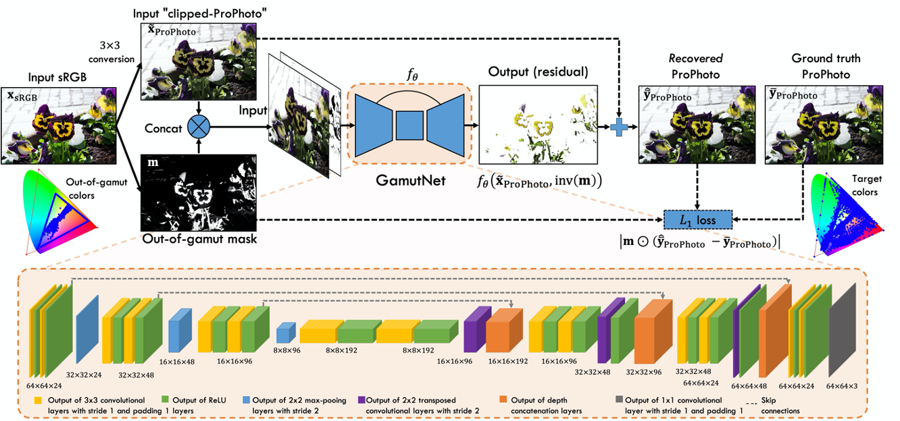

# GamutNet: Restoring-Wide-Gamut-Colors-for-Camera-Captured-Images
_[Hoang M. Le](https://www.linkedin.com/in/hminle/)_, _[Taehong Jeong](https://github.com/taehongjeong)_, _[Abdelrahman Abdelhamed](https://abdokamel.github.io/)_, _[Hyun Joon Shin](https://www.linkedin.com/in/hyun-joon-shin-35aa604b/)_ and _[Michael S. Brown](http://www.cse.yorku.ca/~mbrown/)_

Repo for the paper: 
[GamutNet: Restoring Wide-Gamut Colors for Camera-Captured Images](https://www.ingentaconnect.com/content/ist/cic/2021/00002021/00000029/art00003)

## Overview


## Dataset:

1. Use these links to download our dataset:
- ProPhoto Images: [prop-8bpc.zip 106.4GB](https://ln5.sync.com/dl/5b776c6e0/bkyjim85-3vtf5qdu-x2v7ymse-6jkjbr9i)
- sRGB Images: [srgb-8bpc-1.rar 57.1GB](https://ln5.sync.com/dl/879f8b3f0/fj47dzcm-ewjnc9f9-zeh8paxa-9s4bdmbf) [srgb-8bpc-2.rar 55.9GB](https://ln5.sync.com/dl/748574d10/fjs2kb24-rv7ftvix-nt8amuan-vna52ah2)
- split files: [split.zip 65KB](https://ln5.sync.com/dl/1ea117750/iyvpkiix-qiudb344-gy5ye2nc-x8ishes9)

2. You then need to uncompress ProPhoto to the folder `prop-8bpc` and all two sRGB parts into the folder `srgb-8bpc`. Each of them has 5000 images.
3. You need to modify the path of the above folders in `split txt files`

## How to start training

1. Some basic running scripts:

```
python trainer_main.py --split_path SPLIT_PATH 
```

```
python trainer_main.py --split_path ./split_output --model_size small --patch_size 64 64 --batch_size 64 --gpus "1" --train_num_workers 32 --val_num_workers 32 --max_patches_per_image 1000 --max_epochs 20
```

2. Specifying `hint_mode`:

```
... --hint_mode HINT_MODE --input_channels INPUT_CHANNELS
```

- `--hint_mode none --input_channels 3`: no hint will be provided.
- `--hint_mode o2o_all --input_channels 4`: one-to-one mask (white, in-gamut, and black) will be provided.
- `--hint_mode o2o_rgb --input_channels 6`: per-channel one-to-one mask will be provided.
- `--hint_mode pw_27 --input_channels 4`: the pw_mask_27 normalized by 26 will be provided.


3. Specifying `patch_size':
```
... --patch_size PATCH_HEIGHT PATCH_WIDTH
```

- e.g. `--patch_size 32 32`
- e.g. `--patch_size 64 64`
- e.g. `--patch_size 128 128`


4. Specifying `max_patches_per_image`:
```
... --max_patches_per_image MAX_PATCHES_PER_IMAGE
```

- e.g. given `batch_size=32`, `--max_patches_per_image 32000` will yield 1000 iterations per image 
- e.g.  given `batch_size=128`, `--max_patches_per_image 12800`: will yield 100 iterations per image


5. Specifying `num_workers` for `DataLoader`:

- `--train_num_workers`: default is 2
- `--val_num_workers`: default is 1
- `--test_num_workers`: default is 1

## Citation

```bibtex
@inproceedings{le2021gamutnet,
  title={GamutNet: Restoring Wide-Gamut Colors for Camera-Captured Images},
  author={Le, Hoang and Jeong, Taehong and Abdelhamed, Abdelrahman and Shin, Hyun Joon and Brown, Michael S},
  booktitle={Color and Imaging Conference},
  volume={2021},
  number={29},
  pages={7--12},
  year={2021},
  organization={Society for Imaging Science and Technology}
}
```
